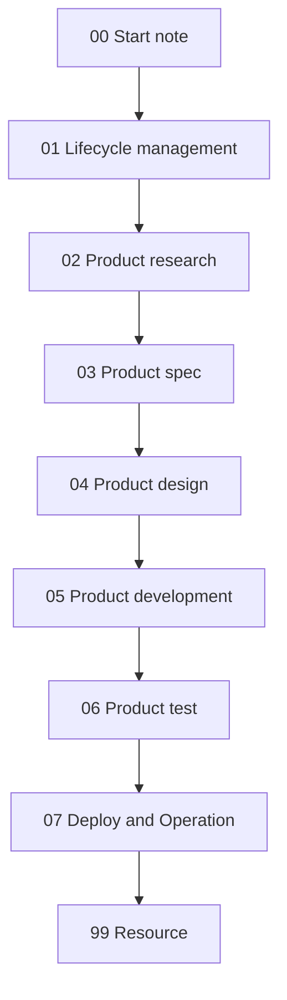

# 01 Lifecycle management

> [!success] Purpose
> This note defines the ==operating lifecycle, build path, and document rules== for Stanley website v2.

## Lifecycle phases
1. `Start`
   - initialize the project and gather the minimum context
2. `Research`
   - understand audience, positioning, and external references
3. `Spec`
   - lock scope, pages, content, and assets
4. `Design`
   - lock visual direction and interaction rules
5. `Development`
   - build the planned V1 with a small implementation scope
6. `Test`
   - verify correctness, quality, and launch readiness
7. `Deploy and Operation`
   - launch, monitor, and iterate

## Recommended build path
- `Next.js`
- `TypeScript`
- `Tailwind CSS`
- local content files
- `Vercel Hobby`

Why this path:
- fast to launch
- low cost
- simple enough for AI agents to work with
- easy to inspect and learn from

## Document rules
- One lifecycle note is the source of truth for one topic.
- Put decisions in the correct lifecycle note instead of duplicating them.
- Keep V1 decisions in the main lifecycle notes.
- Create extra sub-notes only when a topic becomes too large for one note.
- If a note is merged or replaced, turn the old note into a short redirect or remove it after links are updated.
- In this project folder, agents do not need to change the `organized` property after normal note edits.
- For website content, [[03 Product spec]] is the strict source of truth.
- Agents must not add pages, sections, links, CTAs, or copy to the website unless they already appear in [[03 Product spec]].
- If website content is missing from the spec, update [[03 Product spec]] first and only then implement it.

## Agent completion rule
> [!important]
> After an agent finishes its job, it must ==check the documents related to that job and update them if needed== before the task is considered complete.

## Agent note-check rule
> [!important]
> Before starting work, every agent must ==check the related notes in `20260313 Stanley Website`== for the job it is doing.

Minimum start standard for an agent:
1. identify the lifecycle area of the task
2. check the related note or notes in `20260313 Stanley Website`
3. avoid creating a new note if a similar-function note already exists
4. then do the assigned work

Apply this rule like this:
- research agents update [[02 Product research]]
- product/spec agents update [[03 Product spec]]
- design agents update [[04 Product design]]
- development agents update [[05 Product development]]
- test agents update [[06 Product test]]
- deploy/ops agents update [[07 Deploy and Operation]]

Minimum completion standard for an agent:
1. finish the assigned task
2. review the related lifecycle note
3. update decisions, status, or blockers if the work changed them
4. report what changed and what still remains open

## Working rules
- Keep V1 portfolio-first.
- Do not add CMS, database, auth, blog, or complex analytics in V1.
- Prefer local content over operational complexity.
- Finish structure before polishing.
- Document what changed after each meaningful session.

## Entry and exit logic
- `Research -> Spec`
  - move forward when audience, positioning, and site goals are clear enough
- `Spec -> Design`
  - move forward when V1 pages and content needs are defined
- `Design -> Development`
  - move forward when visual direction is locked enough to code
- `Development -> Test`
  - move forward when all planned V1 pages exist
- `Test -> Deploy`
  - move forward when copy, links, visuals, and responsive behavior are checked

## Weekly operating cadence
1. Choose one active lifecycle phase.
2. Define one small weekly outcome.
3. Use AI agents for focused work, not parallel chaos.
4. Make each agent update the related lifecycle note before close-out.
5. Move to the next phase only when the current one is good enough.

## Current phase
> [!note]
> As of `2026-03-14`, the project is between `Spec` and `Design`, and close to `Development` preparation.

## Related notes
- [[00 Start note]]
- [[02 Product research]]
- [[03 Product spec]]
- [[04 Product design]]
- [[05 Product development]]
- [[06 Product test]]
- [[07 Deploy and Operation]]
- [[99 Resource]]
