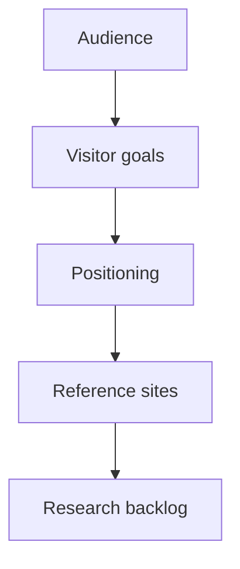

# 02 Product research

> [!note]
> Research for this project should stay lightweight. The goal is not research theater. The goal is to gather enough clarity to make the portfolio site effective.

## Current audience hypothesis
- Potential employers in medical and software industries
- Potential collaborators
- Potential clients
- Other builders evaluating Stanley's work

## Visitor goals
- Understand who Stanley is in under 30 seconds
- See evidence of product leadership and technical depth
- Browse selected public-safe products
- Decide whether to contact or keep exploring

## Positioning hypothesis
- Primary impression:
  - product leader with engineering depth
- Secondary impression:
  - builder who can actually ship
- Current working headline:
  - `I build thoughtful medical and software products with product strategy and engineering depth.`
- Featured product presentation direction:
  - showcase products with a short product brief, Stanley's role, and contribution/achievement context rather than image-only cards

## Reference inputs
- Website V1: https://stanley004.com/
- Company site: https://www.twinbeans.com.tw/
- Personal website UI references are tracked in [[04 Product design]]

## Research questions worth answering later
- What proof matters most to employers versus clients?
- Which project stories are strongest in public-safe form?
- Which metrics feel most credible and easy to verify?
- Should the homepage emphasize `medical products` more strongly than `general builder`?

## V1 research boundary
- enough research to support positioning, copy, and project selection
- no deep market-study process for V1
- no broad persona system unless it clearly changes the site content

## Current known gaps
- Proof metrics need one final verified set
- Product detail page launch scope is still open
- Contact-path placement still needs a final decision

## Related notes
- [[01 Lifecycle management]]
- [[03 Product spec]]
- [[04 Product design]]
