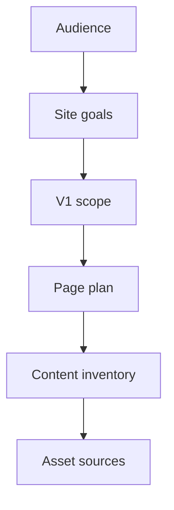

> [!success] Single source of truth
> Use this note as the ==product/spec note== for Stanley website v2.

## Product summary
- Product: personal website / portfolio
- V1 goal: present Stanley clearly and credibly, show real product work, and make contact easy
- V1 outcome: deploy a clean portfolio website on Vercel
- Product role: portfolio first, learning project second
- Design alignment: follow [[04 Product design]]

## Target audience
- Potential employers in medical and software industries
- Potential collaborators
- Potential clients
- Other builders who want to understand Stanley's work

## Visitor goals
- Understand who Stanley is quickly
- See proof of product leadership and technical depth
- Browse selected products and understand Stanley's role
- Decide whether to contact, follow, or continue exploring

## Site goals
- Build a stronger personal brand
- Present company product work in a public-safe way
- Ship a clean V1 that is easy to update
- Create a practical base for future writing, case studies, and product launches

## Main user flow
1. Land on homepage.
2. Understand Stanley's positioning and background quickly.
3. Browse featured products or scan the Projects page.
4. Decide whether to contact, follow, or keep exploring.

## Success criteria
- Site deployed publicly
- Core content complete
- Mobile and desktop both work
- Easy to update project content
- Clear next action for visitors
- Homepage includes featured products, skills, and experience proof

## V1 scope
- Home
- Projects
- Project detail pages built from one shared structure
- Contact page
- Light and dark mode
- Local content files in the repo

### Out of scope
- CMS admin panel
- Authentication
- Database
- Blog platform
- Complex analytics
- Multi-language support
- Complex animations

## Information architecture
- `/`
  - positioning, bio, proof, skills, experience, featured products, contact path
- `/projects`
  - all public-safe products
- `/projects/[slug]`
  - project detail pages with concrete public-safe content
- `/contact`
  - email, LinkedIn, GitHub, X

## Resolved product decisions
- Homepage tone: calm, credible, product-focused
- First impression: product leader with engineering depth
- Secondary impression: builder who can actually ship
- Primary contact direction: both email and LinkedIn
- Shared layout direction: use one repeated navigation bar and one repeated footer across all pages
- Footer contact pattern: keep both a repeated global footer and a dedicated Contact page
- Shared action wording: use `Get in touch` as the quiet global contact CTA in navigation
- Theme support: include explicit light and dark mode support in the shared layout
- Spec-only content rule: only pages, sections, links, and copy explicitly written in this note may appear on the website
- Render-only rule: only explicit UI copy items in a page section may enter the website data layer; planning notes, action descriptions, section-introduction helper text, and internal authoring guidance must not be rendered
- Project detail media rule: do not render a visible `Supporting visuals` heading on product detail pages; show the gallery UI only
- Declared-media rule: every image used on the website must be explicitly listed in this spec under the relevant page section and asset source list
- Project detail gallery rule: when a project has multiple images, use one main image view plus a horizontal thumbnail rail; the thumbnail rail scrolls horizontally when items overflow, clicking a thumbnail updates the main image, and the main image auto-advances every 3 seconds
- Naming rule: use `eKARDIA` consistently as the product name across the website; keep the slug as `/projects/ekardia`
- Product-card tag rule: render tags as plain pills without parentheses
- Product-card content order rule: product cards must render in this order: product name, contribution line, product brief, then role tags
- Product-card contribution rule: treat contribution as one highlighted text line, not as chip tags
- Product-card action rule: cards are fully clickable and should not include a separate `View project` label or button
- Projects page section rule: remove the `Contact CTA / Next step` section from the Projects page in V1
- Contact page section rule: remove the `Final CTA` section from the Contact page in V1
- Public profile links to show: LinkedIn, GitHub, X
- Design alignment: use the locked direction in [[04 Product design]]

## Shared layout
### Goal
- make navigation, contact access, and page framing consistent across the whole site

### Sections

#### 01 Navigation bar
- Content:
  - Placement: fixed or sticky at the top of every page
  - Site identity: `Stanley Lin`
  - Left-side inline items after site identity:
    - Email icon button
    - LinkedIn icon button
    - GitHub icon button
    - X icon button
  - Primary links:
    - `Home`
    - `Projects`
    - `Contact`
  - Secondary actions:
    - Theme toggle button
    - `Get in touch` CTA button
  - Mobile behavior:
    - keep theme toggle visible
    - keep `Get in touch` visible if space allows, otherwise move it into the menu panel
    - collapse primary links behind a menu button on small screens
- Notes:
  - the live V1 site uses `About`, `Projects`, and `Blog`
  - V2 should adapt that structure to `Home`, `Projects`, and `Contact`
  - do not add `Blog` in V1 because writing remains out of scope
  - `Get in touch` should route to `/contact` or the strongest contact path
  - contact items in navigation should primarily use icons to keep the bar clean
  - place the contact icons immediately to the right of `Stanley Lin` in the navigation row

#### 02 Dark mode behavior
- Content:
  - Mode options:
    - `Light`
    - `Dark`
  - Trigger:
    - explicit theme toggle in the shared navigation bar
    - optional system-preference fallback on first load
  - Scope:
    - apply to all pages and shared components
    - include navigation, footer, cards, text, borders, and buttons
  - Persistence:
    - keep the selected theme across page navigation
- Notes:
  - dark mode is part of V1, not optional backlog
  - both themes must keep the same clean and spacious layout

#### 03 Global footer
- Content:
  - Footer headline: `Let's build a great product for the world!`
  - Contact icon buttons:
    - Email
    - LinkedIn
    - GitHub
    - X
  - Scope:
    - show on Homepage
    - show on Projects page
    - show on Project detail pages
    - show on Contact page
- Notes:
  - use the footer as the repeated site-wide contact path
  - keep the dedicated Contact page for visitors who want a full contact screen

## Homepage
### Goal
- establish positioning quickly
- provide proof
- move visitors into projects or contact

### Sections

#### 01 Hero header
- Content:
	- Avatar: [Avatar](../../06%20Resources/99%20Attachment/905387_635171219831242_217474755_o.jpeg)
	- Headline: `I build thoughtful products with product strategy and engineering depth.`
	- Supporting text: I lead products from strategy to launch, bridging product management, design, and engineering to turn complex medical needs into usable products.
  - Layout note: keep the avatar beside the text block and do not place extra text under the avatar
- Primary CTA:
  - Action name: `View Projects`
  - Action description: move visitors to the projects page
- Secondary CTA:
  - Action name: `Contact Stanley`
  - Action description: jump visitors to the clearest contact path

#### 02 Proof metrics
- Content:
	- `12 years of experience`
	- `15 products complete`
	- `5 invention patents`

#### 03 Key skills
- Content:
  - `Front-end development`
    - Icon: `MonitorSmartphone`
    - Building front-end with React and Next.js.
  - `Back-end development`
    - Icon: `Server`
    - Building back-end services with Node.js and Express.js.
  - `Product strategy`
    - Icon: `Layers3`
    - Build vision, mission, and roadmap for products.
  - `Product planning`
    - Icon: `Briefcase`
    - Plan and manage products from the ground up.

#### 04 Experience highlights
- Content:
  - `Twin Beans`
    - Role: `Product Director`
    - Time: `2018-present`
    - recruited and established a software agile development team from scratch
    - led a product team of 6+ members
    - formulated product strategies and increased project value significantly
    - designed products across Windows, Web, and Mobile
  - `ATOM Health`
    - Role: `Medical device engineer`
    - Time: `2015-2017`
    - developed medical device firmware and hardware
    - worked on ECG and health-monitoring products
  - `NeeMe Technologies`
    - Role: `Co-founder, Product Manager`
    - Time: `2014-2015`
    - built a team from scratch
    - independently designed and developed the CaloShop iOS app
  - `ARKNAV International`
    - Role: `Electronics engineer, project manager`
    - Time: `2011-2014`
    - developed ECG heart-rate products used in hospitals
    - worked across electronics engineering and project management

#### 05 Featured products
- Content:
  - `MEDIRECO`
    - Visual: [MEDIRECO.png](Porfolio%20image/TwinBeans/MEDIRECO/MEDIRECO.png)
    - Product brief: Operating-room video recorder and integration system that captures surgical video and key signals for review, teaching, and clinical management.
    - Tags:
      - Role tags:
        - `(Product strategy)`
        - `(Roadmap)`
        - `(UX/UI)`
        - `(Specs)`
      - Contribution tags:
        - `(First integrated surgical recording product in Taiwan)`
  - `MEDISTATION`
    - Visual: [MEDISTATION plateform.jpg](Porfolio%20image/TwinBeans/MEDISTATION/MEDISTATION%20plateform.jpg)
    - Product brief: Web platform that lets physicians study, manage, and revisit surgical cases before and after operations from anywhere.
    - Tags:
      - Role tags:
        - `(Product strategy)`
        - `(Roadmap)`
        - `(UX/UI)`
        - `(Agile lead)`
      - Contribution tags:
        - `(Expanded projects from single-room installs to hospital-scale deals)`
  - `MEDIMEET`
    - Visual: [MEDIMEET.png](Porfolio%20image/TwinBeans/MEDIMEET/MEDIMEET.png)
    - Product brief: Remote surgical streaming platform for teaching, observation, and case discussion without being physically present in the operating room.
    - Tags:
      - Role tags:
        - `(Product strategy)`
        - `(Roadmap)`
        - `(UX/UI)`
        - `(Agile lead)`
      - Contribution tags:
        - `(43 online live-surgery events by 2023)`
  - `MOCAheart`
    - Visual: [cover.webp](Porfolio%20image/MOCACare/cover.webp)
    - Product brief: Portable heart-monitoring product that combines a connected device with a mobile app to measure heart rate, blood oxygen, and pulse-wave related signals.
    - Tags:
      - Role tags:
        - `(iOS app process)`
        - `(iOS app)`
        - `(Firmware)`
      - Contribution tags:
        - `(Resolved Bluetooth ECG packet loss)`
        - `(Shipped in the US)`

### Notes
- Headline should stay direct and professional, not slogan-like.
- Proof should feel concrete and credible rather than inflated.
- Homepage tone should balance `product leader` and `builder`, with product credibility first.
- The homepage should move visitors toward `View Projects` and `Contact Stanley`.

## Projects page
### Goal
- let visitors scan all public-safe work and decide what to open

### Sections

#### 01 Page intro
- Content:
  - Headline: `Selected product work`

#### 02 Project grid
- Content:
  - `MEDIRECO`
    - Visual: [MEDIRECO.png](Porfolio%20image/TwinBeans/MEDIRECO/MEDIRECO.png)
    - Product brief: Operating-room video recorder and integration system for capturing surgical video and device signals.
    - Tags:
      - Role tags:
        - `(Product strategy)`
        - `(Roadmap)`
        - `(UX/UI)`
        - `(Specs)`
      - Contribution tags:
        - `(Flagship product)`
        - `(70%+ revenue)`
        - `(80+ operating rooms)`
    - Detail page slug: `/projects/medireco`
  - `MEDISTATION`
    - Visual: [MEDISTATION plateform.jpg](Porfolio%20image/TwinBeans/MEDISTATION/MEDISTATION%20plateform.jpg)
    - Product brief: Surgical-case management platform for studying, reviewing, and reusing cases across hospitals.
    - Tags:
      - Role tags:
        - `(Product strategy)`
        - `(Roadmap)`
        - `(UX/UI)`
        - `(Agile lead)`
      - Contribution tags:
        - `(Hospital project value grew from $1M to $5M+)`
    - Detail page slug: `/projects/medistation`
  - `MEDIMEET`
    - Visual: [MEDIMEET.png](Porfolio%20image/TwinBeans/MEDIMEET/MEDIMEET.png)
    - Product brief: Remote surgical streaming and discussion platform for teaching and collaboration.
    - Tags:
      - Role tags:
        - `(Product strategy)`
        - `(Roadmap)`
        - `(UX/UI)`
        - `(Agile lead)`
      - Contribution tags:
        - `(43 online live-surgery events by 2023)`
    - Detail page slug: `/projects/medimeet`
  - `MOCAheart / MOCACare`
    - Visual: [cover.webp](Porfolio%20image/MOCACare/cover.webp)
    - Product brief: Consumer heart-monitoring product that combines a portable device and mobile app for everyday vital-sign tracking.
    - Tags:
      - Role tags:
        - `(iOS app process)`
        - `(iOS app)`
        - `(Firmware)`
      - Contribution tags:
        - `(1000+ US users as of 2017)`
    - Detail page slug: `/projects/mocaheart`
  - `JDM`
    - Visual: [Screenshot 2024-01-18 at 4.44.35 PM.png](Porfolio%20image/JDM/Screenshot%202024-01-18%20at%204.44.35%20PM.png)
    - Product brief: Portable device and companion app for monitoring blood oxygen, EKG, and blood pressure anytime.
    - Tags:
      - Role tags:
        - `(iOS app process)`
        - `(iOS app)`
      - Contribution tags:
        - `(Fixed Bluetooth EKG packet drops)`
        - `(500+ users)`
    - Detail page slug: `/projects/jdm`
  - `eKARDIA`
    - Visual: [eKRDIA.png](Porfolio%20image/eKRDIA/eKRDIA.png)
    - Product brief: Portable ECG measurement system for hospital patients, including fall-detection related monitoring use cases.
    - Tags:
      - Role tags:
        - `(Hardware)`
        - `(Firmware)`
        - `(ECG algorithm)`
      - Contribution tags:
        - `(Passed medical-grade safety testing)`
    - Detail page slug: `/projects/ekardia`
  - `CaloShop`
    - Visual: [CaloShop-1.png](Porfolio%20image/CaloShop/CaloShop-1.png)
    - Product brief: Fitness-and-shopping app that turns exercise calories into marketplace discounts.
    - Tags:
      - Role tags:
        - `(Co-founder)`
        - `(PM)`
        - `(iOS developer)`
      - Contribution tags:
        - `(Built and shipped independently to the App Store)`
    - Detail page slug: `/projects/caloshop`
  - `MOCACare medical version`
    - Visual: [Screenshot 2024-01-18 at 4.44.26 PM.png](Porfolio%20image/MOCACare%20medical/Screenshot%202024-01-18%20at%204.44.26%20PM.png)
    - Product brief: Medical-use monitoring variant connected to the broader MOCACare heart-monitoring product line.
    - Tags:
      - Role tags:
        - `(Mobile app)`
        - `(Firmware)`
        - `(Product adaptation)`
      - Contribution tags:
        - `(Adapted portable monitoring experience toward clinical use)`
    - Detail page slug: `/projects/mocacare-medical`

## Project detail pages
### Goal
- explain one product clearly with a consistent structure
- `Gallery media` is an internal content label only and must not render as visible section text on the website.

### Pages

#### 01 MEDIRECO
- Content:
  - Slug: `/projects/medireco`
  - Hero visual: [MEDIRECO.png](Porfolio%20image/TwinBeans/MEDIRECO/MEDIRECO.png)
  - Product brief: MEDIRECO is an operating-room recording and integration system that captures surgical video and key signals so physicians can review and manage cases from multiple perspectives.
  - Tags:
    - Role tags:
      - `(Product strategy)`
      - `(Roadmap)`
      - `(UX/UI)`
      - `(Specs)`
    - Contribution tags:
      - `(First integrated surgical recording product in Taiwan)`
  - Problem:
    - operating rooms needed a reliable way to record crucial surgical video and related information in one system
    - physicians needed a safer review and management workflow after surgery
  - Solution / what was built:
    - built a black-box style surgical recording product
    - defined product strategy and roadmap
    - prioritized user requirements, ran agile development, researched users, planned UX/UI, and wrote specs
  - Outcome / proof:
    - flagship product contributing to over 70% of company revenue
    - installed in 80+ operating rooms nationwide
    - adopted by 70% of medical center-level hospitals in Taiwan
  - Gallery media:
    - [MEDIRECO UI.jpeg](Porfolio%20image/TwinBeans/MEDIRECO/MEDIRECO%20UI.jpeg)
    - [MEDIRECO hardware.png](Porfolio%20image/TwinBeans/MEDIRECO/MEDIRECO%20hardware.png)
    - [MEDIRECO_3600x2000px_03.jpg](Porfolio%20image/TwinBeans/MEDIRECO/MEDIRECO_3600x2000px_03.jpg)
  - Capabilities involved:
    - product strategy
    - roadmap planning
    - UX/UI design
    - specs writing
    - agile team leadership
    - medical-device workflow integration
  - Related projects:
    - `MEDISTATION`
    - `MEDIMEET`

#### 02 MEDISTATION
- Content:
  - Slug: `/projects/medistation`
  - Hero visual: [MEDISTATION plateform.jpg](Porfolio%20image/TwinBeans/MEDISTATION/MEDISTATION%20plateform.jpg)
  - Product brief: MEDISTATION lets physicians study and manage surgical cases before and after operations from anywhere.
  - Tags:
    - Role tags:
      - `(Product strategy)`
      - `(Roadmap)`
      - `(UX/UI)`
      - `(Agile lead)`
    - Contribution tags:
      - `(Scaled projects from room-level installs to hospital-wide deals)`
  - Problem:
    - hospitals needed a better way to organize and revisit recorded surgical cases
    - physicians needed remote access to cases for study and preparation
  - Solution / what was built:
    - built a medical video management platform across web and multi-device workflows
    - handled product strategy, roadmap, user prioritization, UX/UI planning, specs, and agile execution
  - Outcome / proof:
    - enabled the company to plan large-scale projects for entire hospitals
    - increased project value from about 1 million to over 5 million dollars
  - Gallery media:
    - [Data analysis.png](Porfolio%20image/TwinBeans/MEDISTATION/Data%20analysis.png)
    - [MS UI Desktop.png](Porfolio%20image/TwinBeans/MEDISTATION/MS%20UI%20Desktop.png)
    - [MS UI Mobile.png](Porfolio%20image/TwinBeans/MEDISTATION/MS%20UI%20Mobile.png)
    - [MS UI iPad.png](Porfolio%20image/TwinBeans/MEDISTATION/MS%20UI%20iPad.png)
  - Capabilities involved:
    - product strategy
    - UX/UI planning
    - project management
    - multi-device product design
    - agile delivery
  - Related projects:
    - `MEDIRECO`
    - `MEDIMEET`

#### 03 MEDIMEET
- Content:
  - Slug: `/projects/medimeet`
  - Hero visual: [MEDIMEET.png](Porfolio%20image/TwinBeans/MEDIMEET/MEDIMEET.png)
  - Product brief: MEDIMEET provides remote surgical streaming so doctors can teach, study, and discuss cases without being physically in the operating room.
  - Tags:
    - Role tags:
      - `(Product strategy)`
      - `(Roadmap)`
      - `(UX/UI)`
      - `(Agile lead)`
    - Contribution tags:
      - `(43 online live-surgery events by 2023)`
  - Problem:
    - surgical teaching and case discussion were limited by location and room access
    - hospitals needed a remote observation workflow that still fit medical use
  - Solution / what was built:
    - planned and shaped a teleconsultation and remote surgical streaming product
    - covered strategy, roadmap, user requirements, research, UX/UI planning, specs, and agile process
  - Outcome / proof:
    - 43 online live-surgery events organized by 2023
    - over 10 operating rooms using MEDIMEET
  - Gallery media:
    - [MEDIMEET on tablet.jpg](Porfolio%20image/TwinBeans/MEDIMEET/MEDIMEET%20on%20tablet.jpg)
    - [MEDIMEET main page.png](Porfolio%20image/TwinBeans/MEDIMEET/MEDIMEET%20main%20page.png)
    - [MEDIMEET OR list page.png](Porfolio%20image/TwinBeans/MEDIMEET/MEDIMEET%20OR%20list%20page.png)
  - Capabilities involved:
    - product strategy
    - remote-collaboration workflow design
    - UX/UI planning
    - project management
    - agile delivery
  - Related projects:
    - `MEDIRECO`
    - `MEDISTATION`

#### 04 MOCAheart / MOCACare
- Content:
  - Slug: `/projects/mocaheart`
  - Hero visual: [cover.webp](Porfolio%20image/MOCACare/cover.webp)
  - Product brief: MOCAheart is an all-in-one smart heart tracker that measures heart rate, blood oxygen, and pulse-wave related signals through a connected device and mobile app.
  - Tags:
    - Role tags:
      - `(iOS app process)`
      - `(iOS app)`
      - `(Firmware)`
    - Contribution tags:
      - `(Resolved Bluetooth ECG packet loss)`
      - `(Shipped in the US)`
  - Problem:
    - users needed a simpler consumer-facing way to measure heart-related vital signs outside clinical settings
    - the product needed reliable software and hardware integration for connected measurement
  - Solution / what was built:
    - built the iOS app process
    - developed the iOS app for both China and the USA
    - developed firmware for the device
  - Outcome / proof:
    - resolved random Bluetooth EKG packet drops caused by software and hardware integration issues
    - app available in the United States with over 1000 users as of 2017
  - Gallery media:
    - [mocacare_app_ios_android.png](Porfolio%20image/MOCACare/mocacare_app_ios_android.png)
    - [mocaheart_app.png](Porfolio%20image/MOCACare/mocaheart_app.png)
  - Capabilities involved:
    - iOS development
    - firmware development
    - connected-device integration
    - consumer product implementation
  - Related projects:
    - `JDM`
    - `MOCACare medical version`

#### 05 JDM
- Content:
  - Slug: `/projects/jdm`
  - Hero visual: [Screenshot 2024-01-18 at 4.44.35 PM.png](Porfolio%20image/JDM/Screenshot%202024-01-18%20at%204.44.35%20PM.png)
  - Product brief: JDM is a portable device that lets users monitor blood oxygen, EKG, and blood pressure anytime through a connected app experience.
  - Tags:
    - Role tags:
      - `(iOS app process)`
      - `(iOS app)`
    - Contribution tags:
      - `(Fixed Bluetooth EKG packet drops)`
      - `(500+ users)`
  - Problem:
    - users needed a portable vital-sign product that worked reliably in daily use
    - the app and device connection had stability issues during ECG data transfer
  - Solution / what was built:
    - built the iOS app development process
    - developed the iOS app
  - Outcome / proof:
    - resolved the software and hardware integration issue causing random Bluetooth EKG packet drops
    - app available in China with over 500 users as of 2017
  - Gallery media:
    - [Screenshot 2024-01-18 at 4.44.35 PM.png](Porfolio%20image/JDM/Screenshot%202024-01-18%20at%204.44.35%20PM.png)
  - Capabilities involved:
    - iOS development
    - Bluetooth integration
    - mobile product implementation
    - device/app troubleshooting
  - Related projects:
    - `MOCAheart / MOCACare`
    - `MOCACare medical version`

#### 06 eKARDIA
- Content:
  - Slug: `/projects/ekardia`
  - Hero visual: [eKRDIA.png](Porfolio%20image/eKRDIA/eKRDIA.png)
  - Product brief: Portable ECG measurement system for hospital patients, designed to measure ECG and detect falls in care environments.
  - Tags:
    - Role tags:
      - `(Hardware)`
      - `(Firmware)`
      - `(ECG algorithm)`
    - Contribution tags:
      - `(Passed medical-grade safety testing)`
  - Problem:
    - hospitals needed portable ECG monitoring with safety and reliability appropriate for patient care
    - the system needed device intelligence beyond basic signal capture
  - Solution / what was built:
    - designed hardware and firmware
    - independently developed the heart-rhythm algorithm
  - Outcome / proof:
    - passed medical-grade safety standards tests for both software and hardware
    - deployed in a hospital to reduce patient-monitoring burden
  - Gallery media:
    - [eKRDIA.png](Porfolio%20image/eKRDIA/eKRDIA.png)
  - Capabilities involved:
    - hardware design
    - firmware development
    - ECG algorithm development
    - hospital-device implementation
  - Related projects:
    - `JDM`
    - `MOCAheart / MOCACare`

#### 07 CaloShop
- Content:
  - Slug: `/projects/caloshop`
  - Hero visual: [CaloShop-1.png](Porfolio%20image/CaloShop/CaloShop-1.png)
  - Product brief: CaloShop combines fitness tracking and shopping by turning recorded exercise calories into marketplace discounts.
  - Tags:
    - Role tags:
      - `(Co-founder)`
      - `(PM)`
      - `(iOS developer)`
    - Contribution tags:
      - `(Built and shipped independently to the App Store)`
  - Problem:
    - fitness apps and shopping apps were separate experiences, with little direct motivation loop between them
    - the product needed both a consumer concept and an executable first version
  - Solution / what was built:
    - built and led a small team with marketing and product functions
    - developed the iOS app
    - planned and designed the UX/UI
  - Outcome / proof:
    - independently developed the iOS app and launched it on the App Store
  - Gallery media:
    - [CaloShop main page.png](Porfolio%20image/CaloShop/CaloShop%20main%20page.png)
    - [CaloShop product page.jpg](Porfolio%20image/CaloShop/CaloShop%20product%20page.jpg)
    - [CaloShop workout video.jpg](Porfolio%20image/CaloShop/CaloShop%20workout%20video.jpg)
  - Capabilities involved:
    - product design
    - product planning
    - iOS development
    - early-stage team building
  - Related projects:
    - `JDM`
    - `MOCAheart / MOCACare`

#### 08 MOCACare medical version
- Content:
  - Slug: `/projects/mocacare-medical`
  - Hero visual: [Screenshot 2024-01-18 at 4.44.26 PM.png](Porfolio%20image/MOCACare%20medical/Screenshot%202024-01-18%20at%204.44.26%20PM.png)
  - Product brief: Medical-use monitoring variant connected to the MOCACare product line, positioned closer to clinical monitoring scenarios than the consumer app.
  - Tags:
    - Role tags:
      - `(Mobile app)`
      - `(Firmware)`
      - `(Product adaptation)`
    - Contribution tags:
      - `(Adapted portable monitoring experience toward clinical use)`
  - Problem:
    - consumer monitoring patterns did not fully match hospital and medical-use workflows
    - the product line needed a more clinical version for deployment-oriented scenarios
  - Solution / what was built:
    - extended mobile and device-side monitoring experience toward medical-use requirements
    - reused heart-monitoring product knowledge in a more clinical direction
  - Outcome / proof:
    - keep this page public-safe and concise until more source-backed material is confirmed
  - Gallery media:
    - [Screenshot 2024-01-18 at 4.44.26 PM.png](Porfolio%20image/MOCACare%20medical/Screenshot%202024-01-18%20at%204.44.26%20PM.png)
  - Capabilities involved:
    - mobile product adaptation
    - firmware coordination
    - clinical workflow translation
  - Related projects:
    - `MOCAheart / MOCACare`
    - `JDM`

## Contact page
### Goal
- give a low-friction path to reach Stanley

### Sections

#### 01 Intro
- Content:
  - Headline: `Let’s connect`
  - Supporting text: If you want to discuss product work, collaboration, or opportunities, the easiest path is email or LinkedIn.

#### 02 Contact methods
- Content:
  - Email:
    - Icon: `Mail`
    - Value: `flywww004@gmail.com`
  - LinkedIn:
    - Icon: `Linkedin`
    - Value: https://www.linkedin.com/in/stanley004/
  - GitHub:
    - Icon: `Github`
    - Value: https://github.com/flywww
  - X:
    - Icon: `Twitter`
    - Value: https://x.com/flywww004s

## Shared content inventory

### Already available
- Resume: [2023](../../06%20Resources/99%20Attachment/20231127%20%E6%9E%97%E7%9B%88%E5%BF%97%20resume%201.pdf)
- LinkedIn profile PDF: [LinkedIn profile](../../06%20Resources/99%20Attachment/LinkedIn%20profile.pdf)
- CakeResume PDF: [CakeResume](../../06%20Resources/99%20Attachment/CakeResume.pdf)
- Avatar: [Avatar](../../06%20Resources/99%20Attachment/905387_635171219831242_217474755_o.jpeg)
- Explicit product image folder: [Porfolio image](Porfolio%20image)
- Website V1: https://stanley004.com/
- Company website: https://www.twinbeans.com.tw/

### Profile facts
- Name: Stanley Lin
- Current public location: New Taipei City, Taiwan
- Current role: `Product Director` at `TWIN BEANS` from `2018-01` to now
- Website title to use: `Product team lead`

### Future project candidates
- [[20241008 Project - Family Ledger note]]
- [[20240802 Pomoist project]]
- [[20240611 Solidity basic Practice]]

## Asset sources

### Featured product images
- `MEDIRECO`: [MEDIRECO.png](Porfolio%20image/TwinBeans/MEDIRECO/MEDIRECO.png)
- `MEDISTATION`: [MEDISTATION plateform.jpg](Porfolio%20image/TwinBeans/MEDISTATION/MEDISTATION%20plateform.jpg)
- `MEDIMEET`: [MEDIMEET.png](Porfolio%20image/TwinBeans/MEDIMEET/MEDIMEET.png)
- `MOCAheart`: [cover.webp](Porfolio%20image/MOCACare/cover.webp)

### Projects page and detail visuals
- `JDM`: [Screenshot 2024-01-18 at 4.44.35 PM.png](Porfolio%20image/JDM/Screenshot%202024-01-18%20at%204.44.35%20PM.png)
- `eKARDIA`: [eKRDIA.png](Porfolio%20image/eKRDIA/eKRDIA.png)
- `CaloShop`: [CaloShop-1.png](Porfolio%20image/CaloShop/CaloShop-1.png)
- `MOCACare medical version`: [Screenshot 2024-01-18 at 4.44.26 PM.png](Porfolio%20image/MOCACare%20medical/Screenshot%202024-01-18%20at%204.44.26%20PM.png)
- `MEDIRECO hardware`: [MEDIRECO hardware.png](Porfolio%20image/TwinBeans/MEDIRECO/MEDIRECO%20hardware.png)
- `MEDISTATION data analysis`: [Data analysis.png](Porfolio%20image/TwinBeans/MEDISTATION/Data%20analysis.png)
- `MEDISTATION iPad UI`: [MS UI iPad.png](Porfolio%20image/TwinBeans/MEDISTATION/MS%20UI%20iPad.png)
- `MEDIMEET tablet`: [MEDIMEET on tablet.jpg](Porfolio%20image/TwinBeans/MEDIMEET/MEDIMEET%20on%20tablet.jpg)
- `CaloShop workout video still`: [CaloShop workout video.jpg](Porfolio%20image/CaloShop/CaloShop%20workout%20video.jpg)

### Supporting assets
- Avatar: [Avatar](../../06%20Resources/99%20Attachment/905387_635171219831242_217474755_o.jpeg)
- Twin Beans context: [Screenshot 2024-01-19 at 4.59.22 PM.png](Porfolio%20image/TwinBeans/TB%20website/Screenshot%202024-01-19%20at%204.59.22%20PM.png)

### Asset rules
- Use explicit files from `Porfolio image/`
- Do not use exported images from `20231221 Porfolio` for the website UI
- `20231221 Porfolio` is valid as text/content reference only
- Internet images are optional, not required

## Missing items before launch
- final source-backed proof metric set
- fuller source-backed public copy for `MOCACare medical version`
- final decision on which projects get full detail pages at launch

## Open questions
- Confirm one final proof metric set for launch
- Confirm which projects get full detail pages at launch

## Related notes
- [[02 Product research]]
- [[04 Product design]]
- [[05 Product development]]
- [[99 Resource]]
