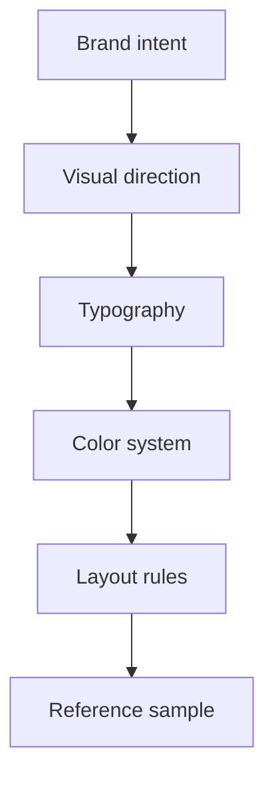

# 04 Product design

## Final direction
> [!success] Locked for V1
> Use a ==simple, quiet, spacious== version of `Direction B: Precision Workshop`.

What this means:
- credible product-professional first
- independent-builder signal second
- simple layout over decorative styling
- whitespace and typography over effects

## UI/UX working rule
> [!important]
> UI/UX decisions must be written here first.

- Put visual rules, interaction rules, icon rules, typography rules, spacing rules, and component rules in this note.
- Do not scatter UI/UX decisions across spec, development, or side notes.
- If a new UI/UX decision overlaps an existing rule, update the existing section instead of creating a new design note.

## Brand traits
- trustworthy
- technical
- product-minded
- calm
- independent builder

## Typography
> [!success] Locked for V1
> Use ==one sans-serif family== across the whole site: `Public Sans`.

Type direction:
- Hero headline: large sans, clear weight, not too tight
- Section headings: same family, lower size step
- Body: same family, medium line-height
- Metadata: same family, smaller size and slightly increased letter spacing

## Color system
> [!success] Palette locked

### Light mode
- `bg-canvas`: `#F2F2F2`
- `line-subtle`: `#CDCDCD`
- `brand-secondary`: `#005691`
- `brand-primary`: `#004A7C`
- `text-primary`: `#182229`
- `text-secondary`: `#5B6770`

### Dark mode
- `bg-canvas`: `#11161B`
- `bg-panel`: `#182028`
- `line-subtle`: `#2A3742`
- `brand-secondary`: `#4B8FC1`
- `brand-primary`: `#6AAAD6`
- `text-primary`: `#EEF3F6`
- `text-secondary`: `#AAB8C2`

## Layout rules
- Prefer `clean and quiet` over `styled and atmospheric`.
- Use a very light canvas with minimal background effects.
- Keep the first screen focused.
- Use one consistent vertical section rhythm across the homepage.
- Keep the gap between `hero -> proof metrics -> key skills -> experience -> featured products` visually consistent.
- Full-width highlight sections must follow the same section margin as standard content sections.
- Keep cards light with thin borders and soft surfaces.

## Avatar rule
- Keep the portrait low profile.
- Treat the avatar as supporting identity proof, not the main visual event.
- Avoid oversized portrait treatment or strong framing effects.
- Keep the crop clean and calm.

## Component direction
- Buttons:
  - primary button uses `brand-primary`
  - secondary button uses border only
- Navigation:
  - simple top bar
  - few links
  - quiet CTA
  - include a `Get in touch` button that feels lighter than the main hero CTA
  - include a theme toggle without turning the header into a tool bar
- Project cards:
  - clear summary cards
  - generous internal padding
  - no flashy hover styling in V1
  - use this content order: product name, contribution line, product brief, role tags
  - contribution should read as one highlighted text line, not as metadata chips
  - keep role tags as the only chip row in the card

## Project detail gallery
- Keep the detail page visually lighter than the homepage cards.
- Use this order in the detail page: product name, main image view, thumbnail rail, merged role/capability tags, product description, problem/solution/outcome, bottom links.
- Use one large main image view above a thumbnail rail.
- Do not render the text label `Supporting visuals` on the page.
- Place thumbnails in a single horizontal row below the main image.
- Allow horizontal scrolling when the thumbnail row overflows.
- Clicking a thumbnail swaps the main image immediately.
- Auto-advance the main image every 3 seconds.
- Pause autoplay on hover, focus, or direct user interaction.
- Keep gallery chrome quiet: thin borders, no heavy frames, no oversized controls.
- Do not use separate `Project snapshot` or `Capabilities involved` cards in the detail-page layout.
- Place related projects as a quiet link list near the bottom-right area without a visible section label.

## Motion behavior
- Allow restrained motion only when it supports comprehension.
- Proof metrics: count up once when the section enters view; duration around `0.8s` to `1.2s`; no looping.
- Project cards: allow a subtle image zoom on hover only; keep scale restrained around `1.02` to `1.04`; do not move the full card layout aggressively.
- Gallery: autoplay may transition the main image gently, but controls should remain secondary to the content.
- Avoid decorative or theatrical motion in V1.

## Icon system
> [!success] Locked for V1
> Use `lucide-react` as the icon system for the website.

Why:
- clean outline style fits the current design direction
- simple and consistent for product-focused UI
- already familiar in Stanley's workflow

Usage rules:
- use one icon set only in V1
- use outline icons, not mixed filled styles
- use `currentColor`
- default sizes:
  - nav / inline: `16` or `18`
  - buttons / cards: `18` or `20`
  - feature blocks: `20` or `24`
- start with stroke width around `1.75` to `2`
- use icons mainly for:
  - contact links
  - dark mode toggle
  - key skill blocks
  - project metadata
  - CTA arrows / external links
  - small section cues
- icon style direction:
  - use icons to keep UI cleaner, not busier
  - prefer one icon per block or action
  - avoid decorating every heading with icons

Approved starter icons:
- `Mail`
- `Linkedin`
- `Github`
- `Twitter`
- `ArrowRight`
- `ExternalLink`
- `MapPin`
- `Briefcase`
- `Layers3`
- `Server`
- `MonitorSmartphone`
- `BadgeCheck`
- `Moon`
- `Sun`

## Theme behavior
- Provide explicit light and dark mode in V1.
- Place the theme toggle in the shared navigation bar.
- Keep the toggle small and quiet, aligned with the clean header design.
- Both themes should preserve the same layout, spacing, and hierarchy.
- Do not redesign components between themes; only adapt color, border, and emphasis levels.

## Homepage comparison
> [!important]
> Temporary comparison variants are allowed during design review, as long as they use only the homepage content already defined in [[03 Product spec]].

- Create `3` homepage variants for comparison.
- Keep the same allowed homepage content across all variants.
- Use the variants only to compare:
  - hero-header layout
  - avatar placement and spacing
  - key-skills block design
- Do not introduce new homepage sections, extra copy, or new actions in the variants.
- Current decision: homepage layout variant `A` is selected as the base direction.

## Key metrics comparison
> [!important]
> Temporary comparison variants are allowed for the `Proof metrics` section while keeping the selected homepage layout fixed.

- Compare only the visual treatment of the existing three proof metrics.
- Keep the same metric values and labels from [[03 Product spec]].
- Explore these direction goals:
  - stronger highlight treatment than the current version
  - full-width treatment across the page rhythm
  - option with number above the line and description below the line
- Do not add extra supporting copy or extra metric items in comparison variants.
- Current decision: key-metrics variant `B` is selected as the base direction.
- Selected implementation rules:
  - keep the metrics section full width
  - do not use a separate background fill for the selected metrics section
  - place the number above the divider line and the description below the divider line
  - avoid strong full-width top and bottom borders that cut across the screen
  - tighten the hero-to-metrics relationship so it does not feel more detached than other section transitions
  - keep the same vertical section spacing rhythm as the rest of the homepage

## Spacing and shape
- Base rhythm: `8px`
- Desktop section spacing: `96px` to `128px`
- Tablet section spacing: `72px` to `96px`
- Mobile section spacing: `56px` to `72px`
- Card padding: `24px` to `32px`
- Card/image radius: `18px` to `24px`
- Shadows: minimal

## What to avoid
- decorative gradients across the whole page
- warm beige backgrounds
- loud accent colors
- crowded hero sections
- multiple font families
- oversized portrait emphasis
- generic startup visuals

## Current approved sample
- [Stanley website v2 - proposal 2 simple](site-assets/design-proposals/Stanley%20website%20v2%20-%20proposal%202%20simple.html)
- Alternative sample: [Stanley website v2 - proposal 2 refined](site-assets/design-proposals/Stanley%20website%20v2%20-%20proposal%202%20refined.html)
- Typography comparison: [Stanley website v2 - typography samples](site-assets/design-proposals/Stanley%20website%20v2%20-%20typography%20samples.html)

## Personal website UI examples
[Personal website example 1](../../06%20Resources/99%20Attachment/Pasted%20image%2020260314152914.jpg)
[Personal website example 2](../../06%20Resources/99%20Attachment/Pasted%20image%2020260314152508.jpg)
[Personal website example 3](../../06%20Resources/99%20Attachment/Pasted%20image%2020260314153802.jpg)
[Personal website example 4](../../06%20Resources/99%20Attachment/Pasted%20image%2020260314153907.jpg)

## Related notes
- [[03 Product spec]]
- [[05 Product development]]
- [[99 Resource]]
