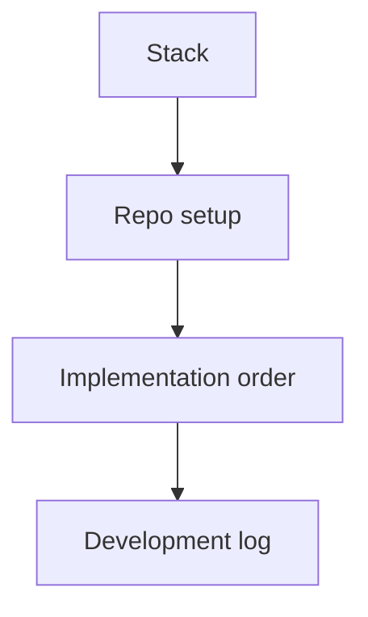

# 05 Product development

## Build stack
- Framework: `Next.js`
- Language: `TypeScript`
- Styling: `Tailwind CSS`
- Content: local content files
- Deployment target: `Vercel Hobby`

## Development rules
- Build the smallest complete V1 first.
- Keep content local and simple.
- Follow [[04 Product design]] for visual decisions.
- Follow [[03 Product spec]] for scope and content.
- Do not put any page, section, CTA, link, or copy on the website unless it already exists in [[03 Product spec]].
- If implementation needs new content, stop and update [[03 Product spec]] first.
- Do not add CMS, database, auth, blog, or complex analytics in V1.

## Repo setup plan
- Keep planning in Obsidian.
- Keep code in a separate Git repo.
- Add `AGENTS.md` in the code repo.
- Add a small `README.md` with:
  - product goal
  - local run command
  - deploy command
  - content model
  - known decisions

## Implementation order
1. Create the code repo.
2. Scaffold the Next.js app.
3. Set up the base layout, typography, and color tokens.
4. Implement the shared layout, navigation bar, and footer.
5. Implement Home, Projects, Contact.
6. Implement the shared project detail page structure with real project content.
7. Move real content and assets into the site.
8. Polish responsive behavior and theme support.

## Architecture direction
- Keep routing simple with App Router.
- Keep content in files, not a database.
- Use one shared site layout for header and footer across all pages.
- Use reusable page sections and card components.
- Prefer static generation where possible.
- Keep the content model small:
  - `profile`
  - `projects`
  - `experience`
  - `social-links`
  - `site-settings`

## Development log

### 2026-03-14
- Created the start note and initial planning notes
- Chose the V1 path: `Next.js + TypeScript + Tailwind CSS + local content + Vercel`
- Kept CMS out of V1
- Confirmed homepage scope: featured products, skills, experience, and contact path
- Locked the visual direction and approved sample HTML
- Reorganized the project notes into lifecycle-based structure

## Current development blockers
- code repo location is not created yet
- final launch metric set still needs confirmation
- launch detail-page scope still needs confirmation

## Related notes
- [[01 Lifecycle management]]
- [[03 Product spec]]
- [[04 Product design]]
- [[06 Product test]]
- [[07 Deploy and Operation]]
