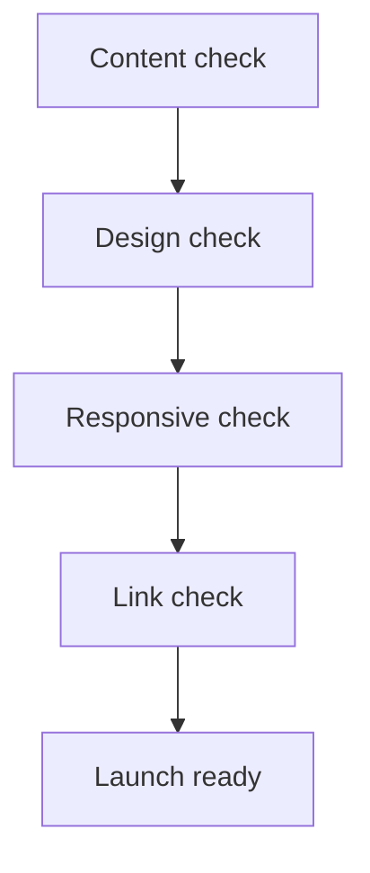

# 06 Product test

## Test goal
- Verify that the portfolio is credible, correct, readable, and ready to publish.

## V1 test areas
- Content correctness
- Public-safe review
- Responsive layout
- Light and dark mode
- Navigation and link behavior
- Asset loading
- Contact path clarity

## Pre-launch checklist
- Homepage headline and intro are final enough
- Metrics are source-backed and consistent
- Navigation links route correctly on desktop and mobile
- Featured product cards are complete
- Homepage bio and experience content are accurate
- Every visible page, section, CTA, link, and line of copy appears in [[03 Product spec]]
- No leftover content from the old website appears unless it is explicitly kept in [[03 Product spec]]
- Footer CTA and social/contact icons are present on every page
- Contact links work
- Mobile layout is readable
- Dark mode remains legible
- Images are cropped and sized appropriately
- No sensitive company information is exposed

## Test method
- Manual pass on desktop
- Manual pass on mobile width
- Self-review with content source notes
- AI-assisted review for obvious consistency issues

## Test results
- No test run recorded yet

## Open test questions
- Which exact devices or viewport sizes should be checked before launch?

## Related notes
- [[03 Product spec]]
- [[04 Product design]]
- [[05 Product development]]
- [[07 Deploy and Operation]]
