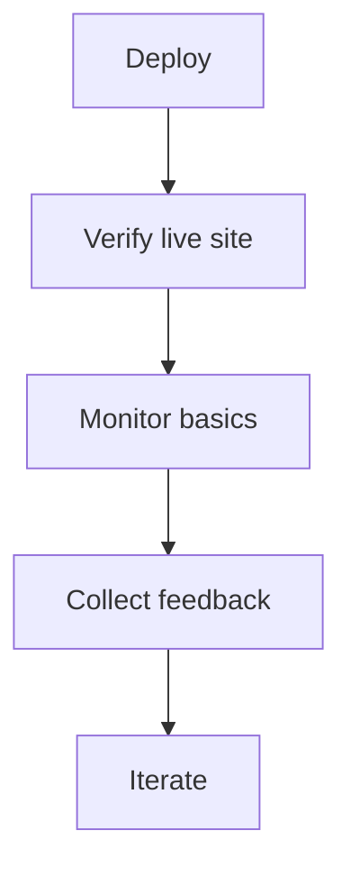

# 07 Deploy and Operation

## Deploy target
- Platform: `Vercel Hobby`
- Site type: static-first personal portfolio

## Deploy checklist
- Code repo is ready
- Environment is minimal and documented
- All V1 pages are complete
- Links and assets are verified
- Public-safe review is complete

## Launch verification
- homepage loads correctly
- pages route correctly
- shared navigation renders and routes correctly
- dark mode works
- contact links open correctly
- global footer renders on every page
- key images render correctly
- mobile and desktop both work
- canonical domain is `https://stanley004.com`
- preview deployments are `noindex`
- `robots.txt` and `sitemap.xml` are reachable
- page title, description, and social preview metadata render correctly

## Operation rules
- Keep the site easy to update.
- Prefer content-file edits over system complexity.
- Use Google Analytics `G-304QB36Y7B` on production only.
- Keep SEO metadata aligned with the canonical domain.
- Add CMS only if content editing becomes painful.

## Post-launch cadence
- Week 1:
  - verify links, visuals, and copy on the live site
- After launch:
  - collect feedback
  - log improvements
  - keep next scope small

## Current SEO and analytics baseline
- Canonical domain: `https://stanley004.com`
- Google Analytics: `G-304QB36Y7B`
- Production indexing only; previews should stay `noindex`
- Public routes should be listed in `sitemap.xml`
- Social metadata should be present on home, projects, contact, and project detail pages

## Future operation backlog
- custom domain refinement if needed
- blog or writing section later
- CMS only after real editing pain
- multilingual support later if justified

## Related notes
- [[05 Product development]]
- [[06 Product test]]
- [[99 Resource]]
