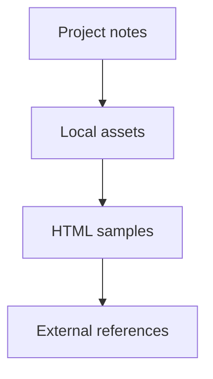

# 99 Resource

## Lifecycle notes
- [[00 Start note]]
- [[01 Lifecycle management]]
- [[02 Product research]]
- [[03 Product spec]]
- [[04 Product design]]
- [[05 Product development]]
- [[06 Product test]]
- [[07 Deploy and Operation]]

## Local asset folders
- [Porfolio image](Porfolio%20image)
- [20231221 Portfolio](20231221%20Portfolio)
- [site-assets-source](site-assets-source)

## HTML samples
- [Stanley website v2 - proposal 2 simple](Stanley%20website%20v2%20-%20proposal%202%20simple.html)
- [Stanley website v2 - proposal 2 refined](Stanley%20website%20v2%20-%20proposal%202%20refined.html)
- [Stanley website v2 - typography samples](Stanley%20website%20v2%20-%20typography%20samples.html)

## Core external references
- Website V1: https://stanley004.com/
- Company site: https://www.twinbeans.com.tw/
- LinkedIn: https://www.linkedin.com/in/stanley004/
- GitHub: https://github.com/flywww
- X: https://x.com/flywww004s

## Core attachments
- Avatar: [Avatar](../../06%20Resources/99%20Attachment/905387_635171219831242_217474755_o.jpeg)
- Resume: [Resume](../../06%20Resources/99%20Attachment/20231127%20%E6%9E%97%E7%9B%88%E5%BF%97%20resume.pdf)
- LinkedIn profile PDF: [LinkedIn profile](../../06%20Resources/99%20Attachment/LinkedIn%20profile.pdf)
- CakeResume: [CakeResume](../../06%20Resources/99%20Attachment/CakeResume.pdf)
- Brochure: [Brochure](../../06%20Resources/99%20Attachment/2025%20Brochure_%E7%91%AA%E5%85%8B%E5%A4%9A_%E9%86%AB%E7%99%82%E5%BD%B1%E5%83%8F%E6%95%B4%E5%90%88%E7%B4%80%E9%8C%84%E6%9A%A8%E9%81%A0%E8%B7%9D%E5%8D%94%E4%BD%9C%E8%A7%A3%E6%B1%BA%E6%96%B9%E6%A1%88.pdf)

## Resource rule
- Put stable references here.
- Put decisions in the lifecycle notes, not in the resource map.
